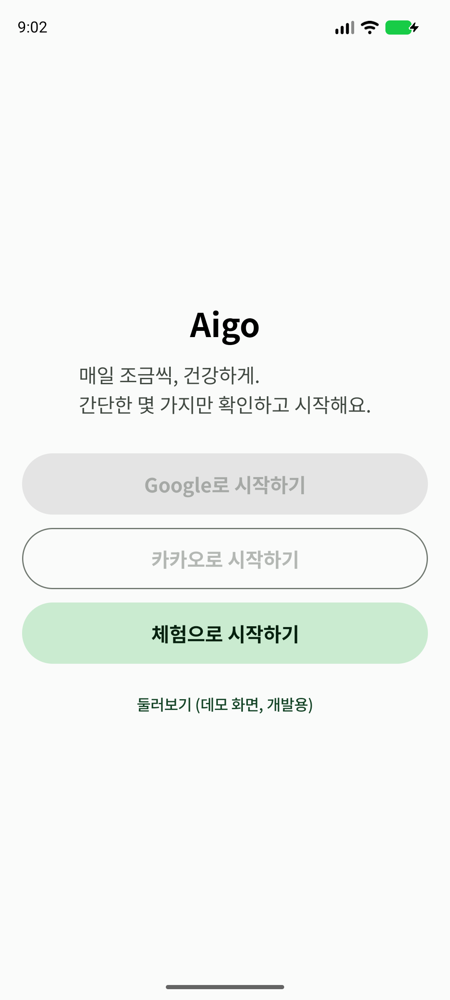
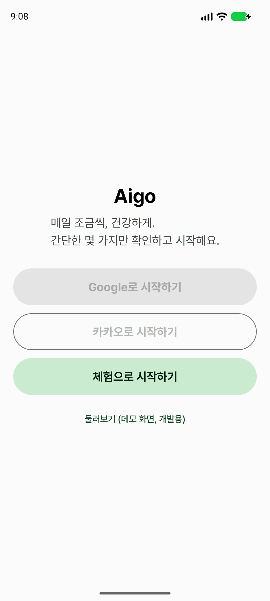
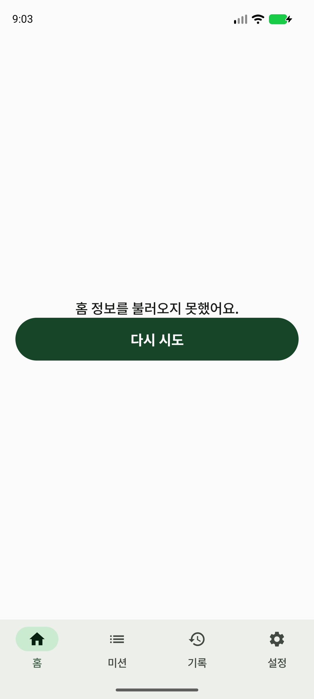
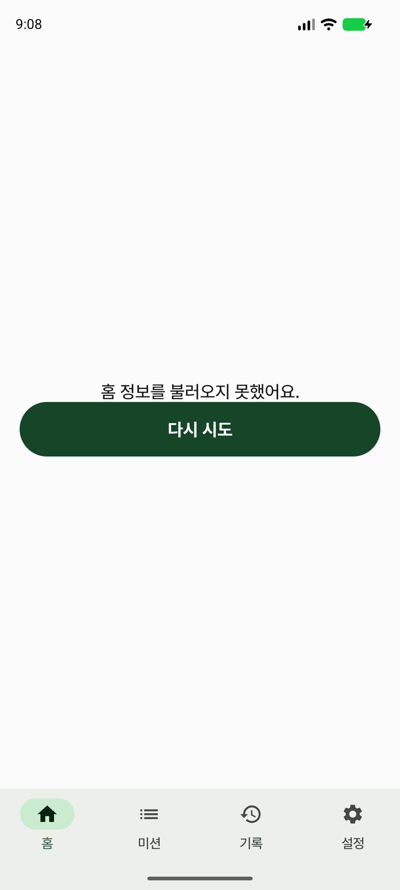

# Noto Sans KR → Pretendard 비교

Pixel 8 에뮬레이터(1080×2400, 420dpi)에서 동일한 앱 상태와 기본 글자 배율로 캡처했다.
글자 크기, 줄간격, 굵기(400/500/700), 색상과 컴포넌트 배치는 유지하고 글꼴 파일만 교체했다.

## 로그인 화면

<table>
  <tr>
    <th>Noto Sans KR (Before)</th>
    <th>Pretendard (After)</th>
  </tr>
  <tr>
    <td></td>
    <td></td>
  </tr>
</table>

## 하단 내비게이션·오류 상태

백엔드가 없는 동일한 로컬 환경에서 개발용 둘러보기에 진입해 캡처했다.

<table>
  <tr>
    <th>Noto Sans KR (Before)</th>
    <th>Pretendard (After)</th>
  </tr>
  <tr>
    <td></td>
    <td></td>
  </tr>
</table>

## 구현 메모

- ZIP의 공식 `public/variable/PretendardVariable.ttf`를 사용했다.
- Compose `FontVariation`으로 기존과 동일하게 400/500/700 굵기를 매핑했다.
- Pretendard OFL 라이선스 전문을 앱 에셋에 포함했다.
- 폰트 파일은 Noto Sans KR 10,414,588바이트에서 Pretendard 6,739,336바이트로 약 3.5MiB 감소했다.
